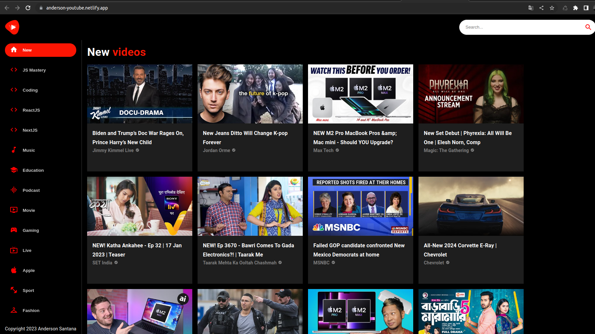

## Projeto criado com inspiração do site youtube

- Projeto desenvolvido utilizando o framework React.js
- Utilizando RapidAPI: https://rapidapi.com/ytdlfree/api/youtube-v31/
- Link do projeto em produção: https://anderson-youtube.netlify.app/

<p align="center">
  
</p>

## Tecnologias utilizadas
- Vite
- ReactJS
- Material UI
- Axios

## Instalação das dependências
```
yarn
```

### Para rodar o projeto
```
yarn dev
```

### Para gerar uma build para produção
```
yarn build
```
